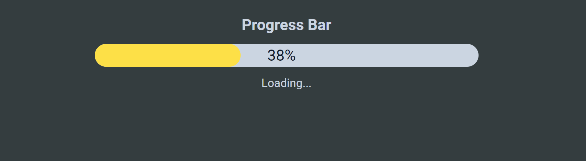

# Module#5 React Day #8 Homework: Progress Bar WebApp


## Hosted Version of the Project:
[m5react-day-7-homework-progress-bar-webapp](https://m5react-day-7-homework-progress-bar-webapp.vercel.app/)

## Objective
+ Developed a Progress Bar user interface component using ReactJS.
+ Created a visual representation of a process that progresses from 0% to 100%.
+ Displayed 'Loading' during progression and 'Complete' when the process reaches 100%.
+ Utilize React's useEffect hook to manage the progression and state changes.


## How to install and run in yours local machine
```bash
npm install
npm run start
```

## Tech. Stack Used:
+ [React](https://react.dev/)
+ [TailwindCSS](https://tailwindcss.com/)
+ [Google Fonts](https://fonts.google.com/)
+ [Font Awesome](https://fontawesome.com/icons/)

## Author
[Abhishek kumar](https://www.linkedin.com/in/alex21c/), ([Geekster](https://geekster.in/) MERN Stack FS-14 Batch)


